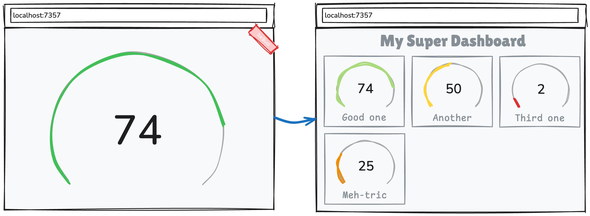

# web_embedding_journey

A simple web app that wants to be more useful!

## Getting Started

This app can be run via:

> `flutter run -d chrome`

## What do we want to do?

Convert this single-view, full-screen flutter web app into a multi-view embedded
web application that renders a list of gauge chart widgets, with their value
passed from JavaScript into Dart.

Something like this:

